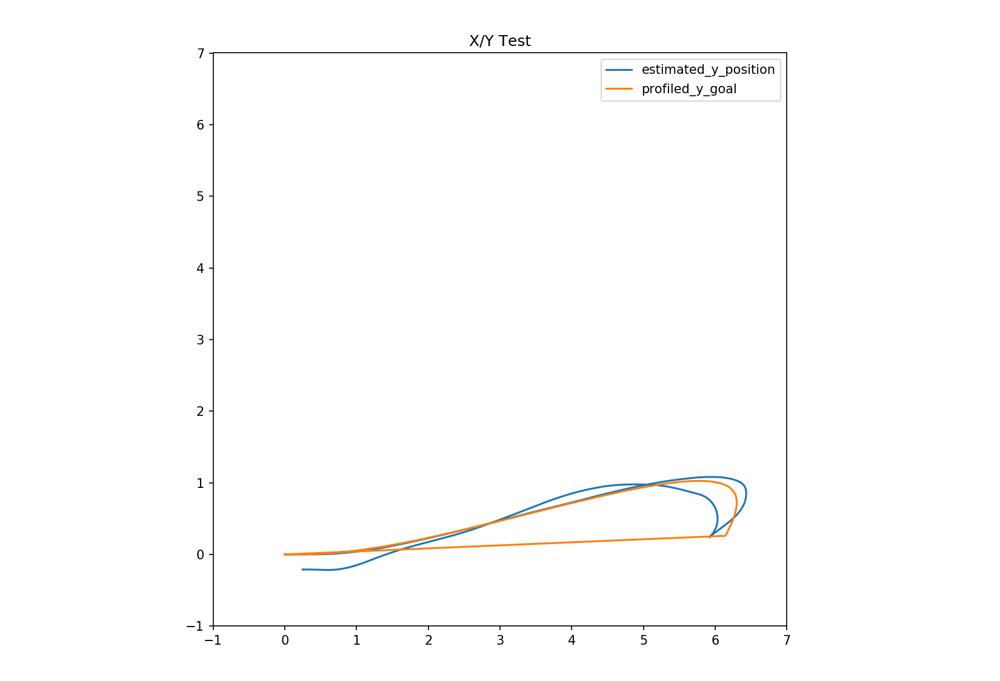
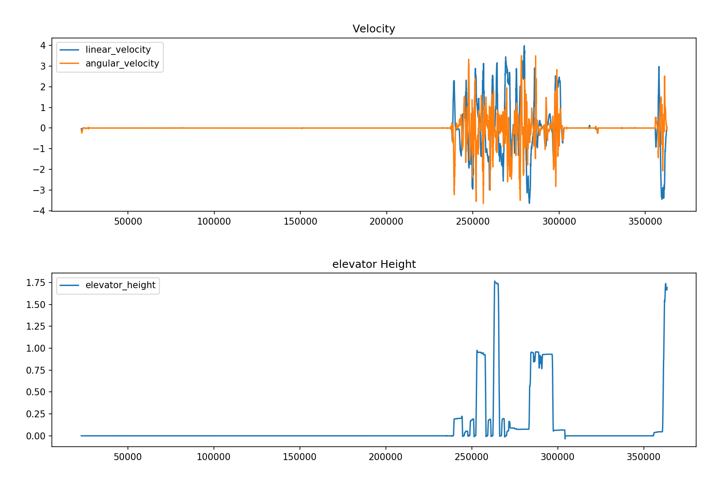

# Overview

The *lime-plotter* application plots data collected from robots in
the First Robotics Competitions and plots them to the screen or to a
PNG file.  It can read data from CSV based log files, or via a
networktables server (IE, from a robot over its wireless network).

# Usage

## Installation

Install any needed modules and the lime-plotter itself:

```
pip3 install --user --upgrade frc1678-lime-plotter
```

Things to plot are specified either via complex command line arguments
with the *-p* switch, or via **easier-to-read-and-write YAML
configuration files** (see the example below).

# Datasources and loaders

There are a number of ways where *lime-plotter* can get data from in
order to draw on its map:

1. CSV log files
2. The robot's Network Tables broadcasting
3. SVG files
4. Timers

Some of these data-sources (CSV and robot data) are specified on the
command line, and others are part of the plot specification file (svg
graphics and timers).

## Reading from CSV log files

*lime-plotter* can be run with a *-L* switch to load CSV files from a
file, multiple files, or a directory of files.  

For example, to load a CSV file:

    lime-plotter -L log.csv

Or calling it with a directory will try to get it to load all the
files from a directory:

    lime-plotter -L DIR
	
Table names will be assumed from the CSV file names.

## Reading from Robot's FRC network tables

To continuously download data from a robot's broadcasted network
tables, use the *-N* switch to specify the robot's IP address to
connect to, and optionally a *-T* switch to specify a default table to
read from.

    lime-plotter -N 10.0.0.1 -T nettable
    
(in general, the -T switch shouldn't be needed except in rare cases)

### Listing available tables / columns from the robot

In order to list the available variables that can be plotted, you can
ask lime-plotter to list the variables it can find given the data
source.  This is most helpful when getting information from a robot,
but also works with CSV logs.  Here's an example of getting the list
of current broadcasted variables from the robot:

    lime-plotter -N 10.0.0.1 -l

# Configuration documentation 

Configuration files for *lime-plotter* are stored in YAML formatted
configuration files.  All data in a YAML file must be contained in a
*plots* dictionary keyword, with each sub-keyword being the name of a
plot.  Within each plot should be an array of things to plot.

further details TBD -- see examples for now

# Example configuration

The following are YAML file configuration examples.

Also see a complete example in `example-configs/2021-example.yml`

## Example single graph

The following example configuration file specifies a single plot
called *position* and plots two overlayed graphs from the Robot's
datasets:

``` yaml
plots:
  position:
    - x: estimated_x_position
      y: estimated_y_position
      xmax: 7
      xmin: -7
      ymax: 7
      ymin: -7
      fixedAspect: True
      title: X/Y Test
    - x: profiled_x_goal
      y: profiled_y_goal
      table: drivetrain_status
      # limits the plot to the last 100 points
      last: 100
```

Saving this configuration to xy.yml and running lime-plotter to load
logs from a *log* directory as follows:

    lime-plotter -L log -y xy.yml -o xytest.png
	
Might produce the following graph:



## Example multiple graphs

To display multiple plots, configuration files can contain multiple
named entries.

    plots:
      velocity:
        - y: linear_velocity
        - y: angular_velocity
          title: Velocity
      elevator:
        - y: elevator_height
          title: elevator Height

And run with

    lime-plotter -L log -y multiple.yml -o multiple.yng
	
Will produce a graph similar to the following:



## Plotting only a single plot from a config file 

Note: you can use the -Y flag to plot only a selected set of sections
of the YAML file.  EG `lime-plotter -L log -y multiple.yml -Y velocity`
will plot only the first graph.

## Including an svg image (such as a field map)

Indicating that a plot is actually a static SVG file to be used as a
background, set the plot's `data_source` to `svg` inside a plot:

    plots:
      - data_source: svg
        file: 2020map.svg
        xmax: 629.25 # scale svg to these dimensions
        ymax: 323.25 # (2020 dimensions in inches)
        alpha: .5

In general, the SVG plotter is not a full featured SVG but can plot
basic SVG lines.  Anything else likely won't work.

As an example, here's a copy of the [FRC 2020 map] as a plottable SVG:

[FRC 2020 map]: ./images/2020map.svg

### Including built in maps

The following map file names can be specified without actually having
a file present, as they're included in the package data:

- 2021.svg
- 2020map.svg      (just the playing field)
- 2020map-rev.svg  (reverses the playing field top to bottom)
- 2020map-full.svg (the full field with human areas)
- 2019map.svg

## adding offsets for your robot's starting position

When your robot starts at a point in the field, you can adjust it's
`xoff` and `yoff` values to set the offsets into the field, with `0,0`
being in the bottom left.

```
plots:
  position:
    - x: Robot X
      y: Robot Y
      xoff: 100
      yoff: 50
      fixedAspect: true
```

# Animation

When plotting from *networktables* (-N) or with the *-a* switch applied,
a window will open that will animate the data flowing over time (live
in the case of *networktables*).  You can use the *-f* switch to
change the frame rate (when graphing CSV files, it'll draw faster with
higher values -- the default is 20; when drawing from network tables
it'll use this value as the polling frequency, and should be set to
the same number of milliseconds that the robot is using to update tables).

## Time markers

A final datasource is "time markers", which draws a small numbered
circle every N seconds.  It is configured like follows to add position
annotations to an existing plot:

```
plots:
  timemarkers:
    # plot the regular robot x/y coordinates
    - x: Robot X
      y: Robot Y
      fixedAspect: true

    # Plot a larger (size 20) dot every 1 second ontop the Robot X/Y marks
    - data_source: timer
      marker_size: 20
      x: Robot X
      y: Robot Y
      delta: 1
```

# Notes on operating system support:

## Note on linux:

The default install path is `~/.local/bin/`; make sure that's in your
path or you can call it from there using `~/.local/bin/lime-plotter`.

## Notes on windows:

Windows installs python scripts differently.  The executable is
`lime-plotter.exe` and is located in
`c:\Users\YOU\AppData\Roaming\Python\Python37\Scripts\lime-plotter.exe`

## Notes on OSX:

It too has a special path -- watch the output of pip3 install to see
where it gets installed and either call it with the full path name or
put that directory in your path.

## Running the code from the [lime-plotter code repo](https://github.com/frc1678/lime-plotter)

If you clone the lime-plotter repo to run the latest and greatest that
isn't installable yet, this command should get you started:

```
PYTHONPATH=. python3 frc1678/limeplotter/main.py -y ../lime-plotter-config/mapped.yml
```
